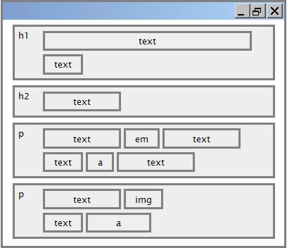

name: inverse
layout: true
class: center, middle, inverse
---
# Web Engineering
## HTML

.footnote[<a href="mailto:christian.ribeaud@karakun.com">Christian Ribeaud</a>]
---
layout: false
.left-column[
  ## The Internet
]
.right-column[
From [Wikipedia](https://en.wikipedia.org/wiki/Internet):

_The **Internet** is the global system of interconnected computer networks that use the Internet protocol suite (TCP/IP) to link devices worldwide._


]
???
- Transmission Control Protocol/Internet Protocol
---
.left-column[
  ## The Web
]
.right-column[
  The **World Wide Web (WWW)**, or simply **Web**, is a way of accessing information over the medium of the **Internet**.
- WWW = HTML.red[*] + HTTP(S)
- http://info.cern.ch/ (first website)

.footnote[.red[*] including CSS, JavaScript, and other browser enabled contents]
]
???
- WWW created in 1989-91 by Tim Berners-Lee
- Popular web browsers released: Netscape 1994, IE 1995
---
.left-column[
  ## HTML
]
.right-column[
**HyperText Markup Language**: used for writing web pages. It describes the **content** and **structure** of _information_ on a Web page.
- `<!DOCTYPE html>`: must be the very first thing in your HTML document, before the `<html>` tag.
The `<!DOCTYPE>` declaration is not an **HTML** tag; it is an instruction to the web browser about what version of **HTML** the page is written in.
- Element: `<tag>content</tag>`. Example: `<p>This is a paragraph</p>`.
  - _Empty_ element: can be opened and closed in one tag. Example: `` (`</img>` NOT allowed).
- Attribute: `<tag name="value">`. Example: `<a href="page2.html">Next page</a>`.
- [Entities](https://www.w3schools.com/html/html_entities.asp): `&copy;`, `&#169;` for **©** 
]
???
- Not the same as the **presentation** (appearance on screen)
- Most whitespace is insignificant in HTML (ignored or collapsed to a single space).
  What could you use to enforce a space?
- Current version is **HTML 5**. This is the one we are going to use.
---
.left-column[
  ## Web Standards
]
.right-column[
It is important to write proper **HTML** code and follow proper syntax. Why?

Lookup:
- [World Wide Web Consortium](https://en.wikipedia.org/wiki/World_Wide_Web_Consortium)
- https://validator.w3.org/
- https://www.w3schools.com/
- [selfHTML](https://wiki.selfhtml.org/) (german)
- https://html5test.com/
- [Can I use](https://caniuse.com/)
]
???
- W3C is the main international standards organization for the W3. Founded and currently led by Tim Berners-Lee.
- https://html5test.com/: how well does your browser support html5?
- https://caniuse.com/: "Can I use" provides up-to-date browser support tables for support of front-end web technologies
on desktop and mobile web browsers.
---
.left-column[
  ## Know your readers!
]
.right-column[
- People with browsers
- [Screen readers](https://en.wikipedia.org/wiki/Screen_reader)
- Search Engines
- [Web crawlers](https://en.wikipedia.org/wiki/Web_crawler)
]
???
- Screen readers are for blind people
- http://www.ribeaud.ch/podcasts/nosey.log
---
.left-column[
  ## Block vs Inline
]
.right-column[


**Block** elements contain an entire large region of content. Examples: paragraphs, lists, tables, ...

**Inline** elements affect a small amount of content. Examples: bold text, images, links, ...

**Inline** elements are NOT allowed to have **block** elements inside.
]
---
.left-column[
  ## Key elements
]
.right-column[
- `<html>`
- `<head>`
- `<body>`
- `<title>`
- `<h1>`, `<h2>`, ...`<h6>` (_block_)
- `<p>`
- `<a>` (_inline_): links, or **anchors**, to other pages.
- `` (_inline_)
- `<meta>`: describes meta data of the web page. Metadata will not be displayed on the page, but will be machine parsable.
]
---
.left-column[
  ## Key elements
  ### image
]
.right-column[
```xml
<a href="default.asp" title="Go to W3Schools HTML section">
  
</a>
```]
---
.left-column[
  ## Key elements
  ### image
  ### meta
]
.right-column[
  ```xml
  <head>
    <meta charset="UTF-8"><!-- HTML5 specific! -->
    <meta name="description" content="Free Web tutorials">
    <meta name="keywords" content="HTML,CSS,XML,JavaScript">
    <meta name="author" content="John Doe">
    <meta http-equiv="refresh" content="30">
  </head>
  ```
]
---
.left-column[
  ## Collections
]
.right-column[
- `<ol>`
- `<ul>`
- `<table>`
]
---
.left-column[
  ## Presentational
]
.right-column[
- `<em>` (`<i>`)
- `<strong>` (`<b>`)
- `<br />` (_inline_): should be immediately closed with `/>`.
- `<hr />` (_block_): horizontal rule. Should be immediately closed with `/>`.
]
---
.left-column[
  ## Form
]
.right-column[
- `<form>`
- `<input>`
- `<textarea>`
- `<select>`
- `<button>`
]
---
.left-column[
  ## Semantic web
]
.right-column[
**Semantics** is the study of the meanings of words and phrases in a language.

**Semantic** elements = elements with a meaning.

Examples:

- `<nav>`
- `<footer>`
- `<address>`
- `<article>`
- `<section>`
]
---
.left-column[
  ## Which is Which?
]
.right-column[
- `<html><body></html></body>`
- `<html><body  </body></html>`
- `<span><div></div></span>`
- `<p><em>x</em></p>`
- `<p><em>x<p>`
]
---
.left-column[
  ## HTML is forgiving
]
.right-column[
- Unknown tags are ignored
- Unknown attributes are ignored
- ... and browsers display almost anything
]
---
.left-column[
  ## Global attributes
]
.right-column[
- `id`
- `class`
- `style`
- `title`
- `data-*`: The **data-*** attributes is used to store custom data private to the page or application. The **data-*** attributes gives us the ability to embed custom data attributes on all HTML elements.
]
---
.left-column[
  ## Exercises
  ### Assignment 1
]
.right-column[
### Assignment 1

- Extend/change [first.html](https://ribeaud.github.io/WebEngineering/lectures/1/first.html) and view in the browser
- Correct [first.html](https://ribeaud.github.io/WebEngineering/lectures/1/first.html) to be valid HTML
and validate your work with https://validator.w3.org
]
---
.left-column[
  ## Exercises
  ### Assignment 1
  ### Assignment 2
]
.right-column[
### Assignment 2

- https://www.w3schools.com/html/html_exercises.asp
- https://www.w3schools.com/html/html_quiz.asp
]
---
.left-column[
  ## Exercises
  ### Assignment 1
  ### Assignment 2
  ### Assignment 3  
]
.right-column[
### Assignment 3

Choose one of the following topics and create an **HTML** solution that you can extend over the course
of this semester.

Possible topics:

- A web solution to keep track of your daily learning achievements.
- A web solution to keep track of your programming errors.
- A web solution to keep track of your plans in life.
- ...
]
---
.left-column[
  ## Exercises
  ### Assignment 1
  ### Assignment 2
  ### Assignment 3  
  ### Training for aspiring professionals
]
.right-column[
### Training for aspiring professionals

- Create an **HTML** page with a form
- Make the form action sending an email to <a href="mailto:christian.ribeaud@karakun.com">christian.ribeaud@karakun.com</a>
- On the web, find the resource about HTML that you like best
- Use the form to submit a link to that resource and a description on why you like it
]
