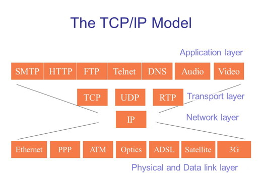

name: inverse
layout: true
class: center, middle, inverse
---
# Web Engineering

.footnote[<a href="mailto:christian.ribeaud@karakun.com">Christian Ribeaud</a>]
---
layout: false
.left-column[
  ## The Internet
]
.right-column[
From [Wikipedia](https://en.wikipedia.org/wiki/Internet):

_The **Internet** is the global system of interconnected computer networks that use the Internet protocol suite (TCP/IP) to link devices worldwide._

]
???
- Transmission Control Protocol/Internet Protocol
---
.left-column[
  ## The Web
]
.right-column[
  The **World Wide Web (WWW)**, or simply **Web**, is a way of accessing information over the medium of the **Internet**.
- WWW = HTML.red[*] + HTTP(S)

.footnote[.red[*] including CSS, JavaScript, and other browser enabled contents]
]
???
- WWW created in 1989-91 by Tim Berners-Lee
- Popular web browsers released: Netscape 1994, IE 1995
---
.left-column[
  ## HTML
]
.right-column[
**HyperText Markup Language**: used for writing web pages. It describes the **content** and **structure** of _information_ on a Web page.
- `<!DOCTYPE html>`: must be the very first thing in your HTML document, before the `<html>` tag.
The `<!DOCTYPE>` declaration is not an **HTML** tag; it is an instruction to the web browser about what version of **HTML** the page is written in.
- Element: `<tag>content</tag>`. Example: `
This is a paragraph
`.
- Attribute: `<tag name="value">`
- [Entities](https://www.w3schools.com/charsets/ref_html_entities_4.asp): `&lt;`, `&#x3C;` for **<** 
]
???
- Not the same as the **presentation** (appearance on screen)
- Most whitespace is insignificant in HTML (ignored or collapsed to a single space)
- Current version is **HTML 5**. This is the one we are going to use.
---
.left-column[
  ## Lookup
]
.right-column[
- W3C Specifications
- https://validator.w3.org/
- https://www.w3schools.com/
- [selfHTML (ger)](https://wiki.selfhtml.org/)
- https://html5test.com/
- [Can I use](https://caniuse.com/)
]
---
.left-column[
  ## Readers
]
.right-column[
- People with Browsers
- [Screen readers](https://en.wikipedia.org/wiki/Screen_reader)
- Search Engines
- [Web crawlers](https://en.wikipedia.org/wiki/Web_crawler)
]