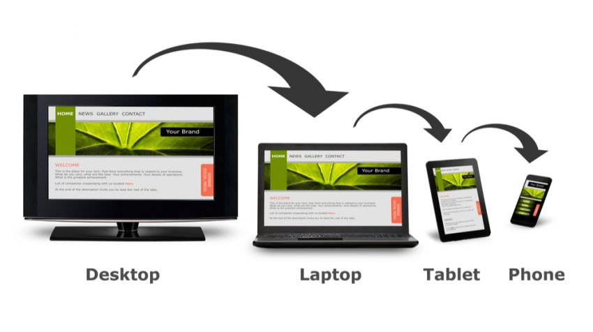

name: inverse
layout: true
class: center, middle, inverse
---
# Web Engineering
## Mobile Web

.footnote[<a href="mailto:dierk.koenig@fhnw.ch">Prof. Dierk König</a><br /><a href="mailto:christian.ribeaud@fhnw.ch">Christian Ribeaud</a>]
---
layout: false
.left-column[
  ## Responsive Design
]
.right-column[
**Responsive Web Design** is an approach whereby a designer creates a web page that _responds to_ or resizes itself depending on the type of device it is being seen through.


]
???
- https://github.com/WebEngineering-FHNW/fs19-de-cr-graded-exercise-Humbi1992
---
.left-column[
  ## Setting The Viewport
]
.right-column[
```html
<meta name="viewport"
content="width=device-width, initial-scale=1.0">
```
This will set the viewport of your page, which will give the browser instructions on how to control the page's dimensions and scaling.
]
???
https://www.w3schools.com/html/html_responsive.asp
---
.left-column[
  ## Approaches
]
.right-column[
Prerequisite Knowledge: **HTML**, **CSS**, **JavaScript**, **Web-MVC**
- Flexible layout (**CSS**)
- Media queries (**CSS**)
- Dynamic in-page logic (**HTML**, **JS**)
- Serve different views per capability (**MVC**)
]
---
.left-column[
  ## Approaches
  ### Flexible layout
]
.right-column[
Responsive sites use _fluid grids_. All page elements are sized by proportion, rather than pixels.
#### Width
```html

```
#### Layout
From [float](https://www.w3schools.com/css/css_float.asp), to [flex](https://css-tricks.com/snippets/css/a-guide-to-flexbox/) layout (and to [grid](https://css-tricks.com/snippets/css/complete-guide-grid/) layout)

https://jsfiddle.net/86eLnadb/21/
#### Text size
The text size can be set with a **vw** unit, which means the _viewport width_.
#### `<picture>`
The **HTML** `<picture>` element allows you to define different images for different browser window sizes.
]
???
- https://www.w3schools.com/html/html_responsive.asp
- https://www.smashingmagazine.com/2017/07/enhancing-css-layout-floats-flexbox-grid/
---
.left-column[
  ## Approaches
  ### Flexible layout
  ### Media queries
]
.right-column[
Change the width of element identified by ID `#title` to **100%** when the browser window is _800px_ wide or less:
```css
#title { width: 50%; }

@media screen and (max-width: 800px) {
   #title { width: 100%; }
}
```
For browser window width between **361px** and **400px**:
```html
<link rel="stylesheet" type="text/css" media="screen and
(min-width: 361px) and (max-width: 480px)"
href="landscape.css">
```
If you apply two rules that collide to the same elements, it will choose the last one that was declared, unless the first one has the `!important` marker or is more specific.

#### Media query attributes

max-width, max-device-width, min-width, min-device-width, (height) orientation (portrait, landscape), [min-,max-,device-]aspect-ratio, ...
]
???
- [Media queries examples](https://www.w3schools.com/css/css3_mediaqueries_ex.asp)
- [min-width vs. min-device-width](https://stackoverflow.com/questions/15276218/css-media-queries-min-width-and-min-device-width-conflicting)
- [CSS Media Queries & Using Available Space](https://css-tricks.com/css-media-queries/)
---
.left-column[
  ## Approaches
  ### Flexible layout
  ### Media queries
  ### Dynamic in-page logic
]
.right-column[
```html
<body onresize="adapt()">

<script>
   function adapt() { …; screen.size … }
</script>
screen vs. window vs. page
```
]
---
.left-column[
  ## Approaches
  ### Flexible layout
  ### Media queries
  ### Dynamic in-page logic
  ### View per Capability
]
.right-column[
#### Questions
- How to detect the capability?
- How to change the view?


]
---
.left-column[
  ## How to change the view?
]
.right-column[
Using browser detection [plugin](http://plugins.grails.org/plugin/mathifonseca/browser-detection) on **server** side.
#### Possible strategies
- Use different **CSS**
- Select a different **Grails** _layout_
- Rendering a different _view_
]
---
.left-column[
  ## When to use
]
.right-column[
#### Rule of thumb
|                                           |                        |
|-------------------------------------------|------------------------|
|**CSS** _float_ (or _flexbox_, or _grid_)  | Always consider        |
|`@media`                                   | Mostly static content  |
|`onresize`                                 | Fine-grained control   |
|**MVC**                                    | Default                |
]
---
.left-column[
  ## Demo / Live-coding
]
.right-column[
#### Exercises
- [exercise.html](exercise.html)

#### Possible workflows
- How to connect with a mobile device to localhost?
- Using flexible layout
- Using media queries
- Using **server pages** for mobile views
]
???
- https://www.w3schools.com/howto/howto_css_responsive_header.asp
---
.left-column[
  ## Practical Work
]
.right-column[
Make a page of your choice web friendly. Suggestion: in [InPlaceCalculator](https://github.com/ribeaud/WebEngineering-HS19/branches) (branch: _feature/inplacecalculator_), put label on the left of corresponding input field when there is enough place, on the top otherwise.
]
---
.left-column[
  ## Abilities
]
.right-column[
Being able to make a web experience mobile-friendly.
]
---
.left-column[
  ## Knowledge
]
.right-column[
Knowing the four ways of adapting a web presence to varying
device capabilities.
]
