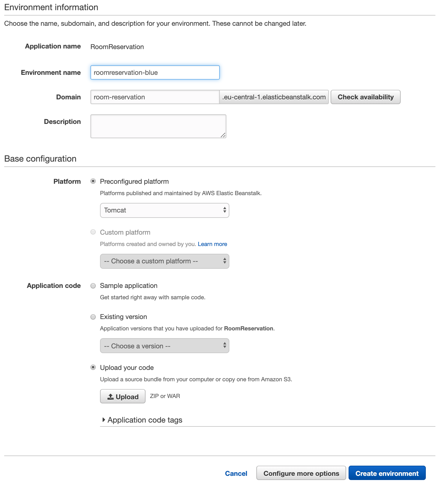

name: inverse
layout: true
class: center, middle, inverse
---
# Web Engineering
## Deployment

.footnote[<a href="mailto:dierk.koenig@fhnw.ch">Prof. Dierk König</a><br /><a href="mailto:christian.ribeaud@fhnw.ch">Christian Ribeaud</a>]
---
layout: false
.left-column[
  ## Three Options
]
.right-column[
1. Upload WAR file to **Java** web server, e.g. **Tomcat** via _manager-gui_
1. Upload WAR file to a **PaaS** provider
1. Upload executable WAR to an **IaaS** provider (upload to a provided/available VM)
1. Using **Docker**. Either with a _Java_ or a _Tomcat_ image, or as _Grails_ container (see [here](https://guides.grails.org/grails-as-docker-container/guide/index.html) for instructions).
]
---
.left-column[
  ## Tomcat
]
.right-column[
1. Install **Java**
1. Install **Tomcat** (_v9_ is fine) up to a tutorial found in the Internet (I've used `brew install tomcat`)
1. Make sure you've set an user having role _manager-gui_ (you have to adapt `tomcat-users.xml` file):
```xml
...
      <role rolename="manager-gui"/>
      <user username="tomcat" password="tomcat" roles="manager-gui"/>
</tomcat-users>
```
1. Increase **Tomcat** upload file size limit as suggested [here](https://tecadmin.net/increase-tomcat-upload-file-size-limit/)
1. Generate the WAR (`./grailsw dev war`)
1. Upload WAR file via _manager-gui_
1. When starting **Tomcat**, make sure that the right **Java** version is picked up.


]
???
We are still using the `development` environment (and NOT the `production` one). This is for two reasons:
- We do NOT currently have a proper database
- Writing to the filesystem (as **H2** would do) could be problematic
---
.left-column[
  ## PaaS
]
.right-column[
Upload WAR file to a _Platform-as-a-Service_ (**PaaS**) provider, e.g. [Elastic Beanstalk](https://aws.amazon.com/elasticbeanstalk/)


]
???
- http://guides.grails.org/grails-elasticbeanstalk/guide/index.html
- [How to deploy a Grails 3 app to AWS Beanstalk](https://medium.com/agorapulse-stories/how-to-deploy-grails-3-app-to-aws-elastic-beanstalk-with-gradle-and-travis-318d084c0f7d)
---
.left-column[
  ## IaaS
]
.right-column[
1. Install **Java12** on the target VM
1. Upload WAR to the provisioned/prepared VM using tools like [scp](https://en.wikipedia.org/wiki/Secure_copy)
1. This WAR is executable. Start the application with `java -jar <my-war>`
]
---
.left-column[
  ## Web Atrocities
]
.right-column[
- Care for your data (download, backup, accessibility/protection)
- Data harvesting: data harvesting is a process where a small script, also known as a malicious bot, is used to automatically extract large amount of data from websites and use it for other purposes.
- Data protection
- Denial-of-service ([DoS](https://en.wikipedia.org/wiki/Denial-of-service_attack)) attacks, Spamming
- Proper password handling, encryption
- Logging, monitoring
- Localization
 formats, timezones, character encoding
- Server updates/upgrades
- Server security access
]
???
- [What You Need to Know about Data Harvesting and How to Prevent it](https://blog.caspio.com/what-you-need-to-know-about-data-harvesting-and-how-to-prevent-it/)
- [7% of All Amazon S3 Servers Are Exposed, Explaining Recent Surge of Data Leaks](https://www.bleepingcomputer.com/news/security/7-percent-of-all-amazon-s3-servers-are-exposed-explaining-recent-surge-of-data-leaks/)
---
.left-column[
## What we've learned
]
.right-column[
### Abilities

Being able to deploy to an open **PaaS** provider.

### Knowledge

Knowing some of the atrocities and difficulties that come
with being on the web.

### Links
- https://docs.grails.org/latest/guide/deployment.html
]
