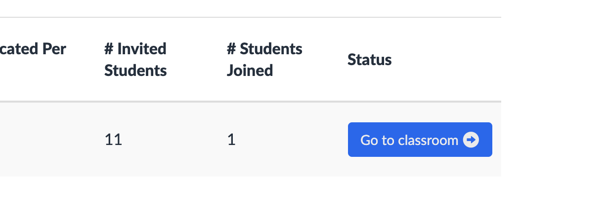
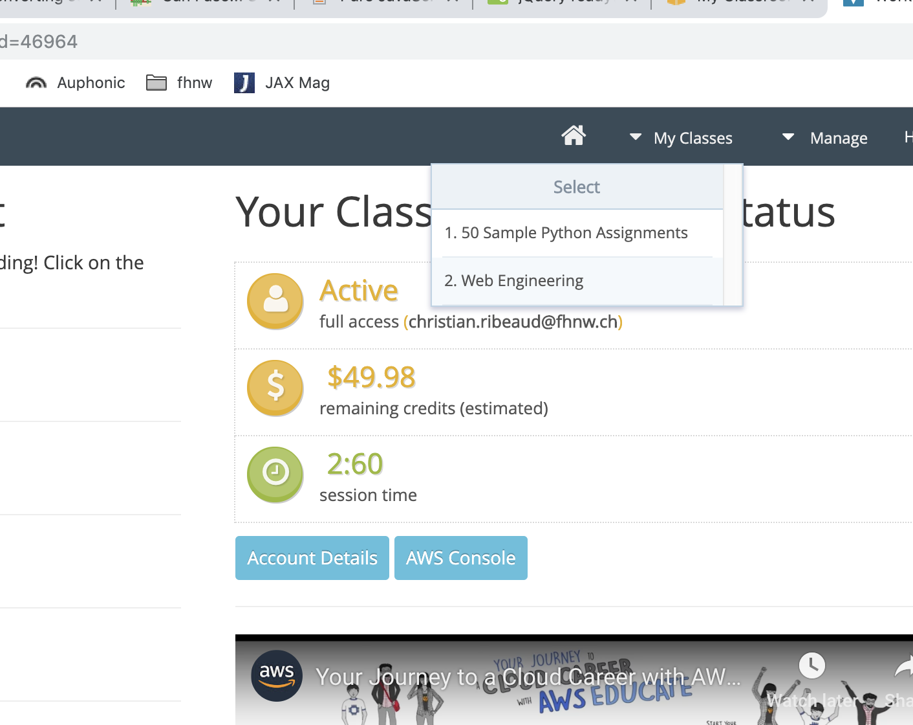
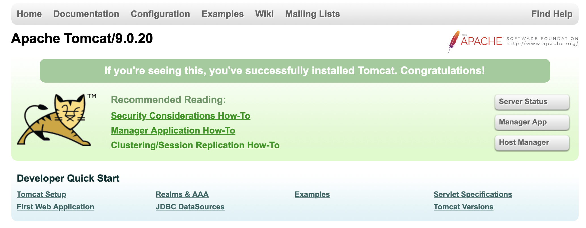

name: inverse
layout: true
class: center, middle, inverse
---
# Web Engineering
## Deployment

.footnote[<a href="mailto:dierk.koenig@fhnw.ch">Prof. Dierk König</a><br /><a href="mailto:christian.ribeaud@fhnw.ch">Christian Ribeaud</a>]
---
layout: false
.left-column[
  ## Classroom (lecturer)
]
.right-column[
To access the **AWS** classrom, perform following steps:
1. Login to https://awseducate.com/.
1. Click on **MY CLASSROOMS**. This link is ONLY present on the dashboard (click on the top-left corner if you've already used the navigation bar).<br />
1. Go to the appropriate classroom.<br />
1. Select your class. You will find there the link to **AWS** console.<br />.
]
---
.left-column[
  ## Three Options
]
.right-column[
1. Upload WAR file to **Java** web server, e.g. **Tomcat** via _manager-gui_
1. Upload _fat_ JAR file to a **PaaS** provider
1. Upload executable to an **IaaS** provider (upload to a provided/available VM)
]
---
.left-column[
  ## Preparation
]
.right-column[
### Adapt grails-app/conf/application.yml
~~node~~ should become **create**
```yml
production:
  dataSource:
    dbCreate: create
```
Only on first deployment!
]
---
.left-column[
  ## Tomcat
]
.right-column[
1. Install **Java**
1. Install **Tomcat** up to a tutorial found in the Internet (I've used `brew install tomcat`)
1. Make sure you've set an user having role _manager-gui_ (you have to adapt `tomcat-users.xml` file)
1. Generate the WAR (`./grailsw war`)
1. Upload WAR file via _manager-gui_

]
---
.left-column[
  ## Abilities
]
.right-column[
  Being able to deploy to an open **PaaS** provider.
]
---
.left-column[
  ## Knowledge
]
.right-column[
Knowing some of the atrocities and difficulties that come
with being on the web.

### Atrocities when running on the web

DDoS, spam, captcha, password storage, lost passwords, content encoding
harvesting, logging, monitoring, (locale, time zones, character encodings)
data protection, forgetful data
]
---
