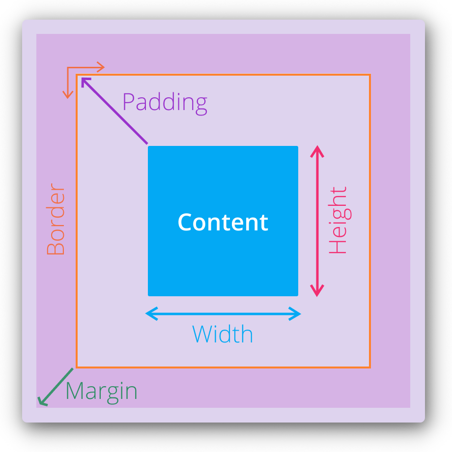
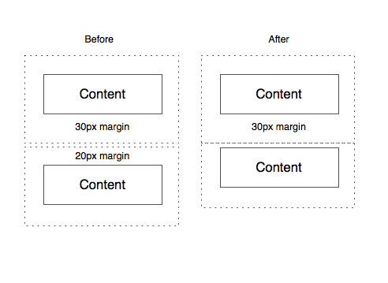

name: inverse
layout: true
class: center, middle, inverse
---
# Web Engineering
## CSS

.footnote[<a href="mailto:dierk.koenig@fhnw.ch">Prof. Dierk König</a><br /><a href="mailto:christian.ribeaud@fhnw.ch">Christian Ribeaud</a>]
---
layout: false
.left-column[
  ## CSS
]
.right-column[
- **C**ascading **S**tyle **S**heet
- Contains the rules for the _presentation_ of **HTML**
- **CSS** + **HTML** = **Web Page**
- One **HTML** Page - Multiple Styles!
]
???
- https://worldwideweb.cern.ch/
- Separation of concerns: **CSS** (_presentation_) vs. **HTML** (_content_)
- https://www.w3schools.com/css/css_intro.asp
---
.left-column[
  ## CSS Rule
]
.right-column[

]
---
.left-column[
  ## CSS Selectors
  ### element
]
.right-column[
### CSS
```css
div {
  text-align: center;
  color: red;
}
```
### HTML excerpt
```html
<div>Hello</div>
<div>Again</div>
<p>
  <div>Enjoying the day...</div>
</p>
```
]
???
- https://jsfiddle.net/a5bw10Lf/
---
.left-column[
  ## CSS Selectors
  ### element
  ### id
]
.right-column[
### CSS
```css
#flower {
  text-align: center;
  color: red;
}
```
### HTML excerpt
```html
<div id="flower">rose</div>
<div id="language">JavaScript</div>
```
]
---
.left-column[
  ## CSS Selectors
  ### element
  ### id
  ### class
]
.right-column[
### CSS
```css
.center {
  text-align: center;
  color: red;
}
```
### HTML excerpt
```html
<div class="center">center</div>
<div class="left">left</div>
<footer class="center">
&copy; Karakun AG
</footer>
```
]
???
- A list of **CSS** classes could be specified as attribute value (i.e., `right top`)
- `*` selects **all** elements
---
.left-column[
  ## Special Selectors
  ### attribute
]
.right-column[
### CSS
```css
[title] {
  text-align: center;
  color: red;
}
```
### HTML excerpt
```html
<div title="My Div">One</div>
<div title>Two</div>
<div class="left">left</div>
```
]
---
.left-column[
  ## Special Selectors
  ### attribute
  ### attribute/value
]
.right-column[
### CSS
```css
[title="x"] {
  text-align: center;
  color: red;
}
```
### HTML excerpt
```html
<div title="x">One</div>
<div title>Two</div>
<div class="left">left</div>
```
]
???
- `^=` (_begins with_), `$=` (_ends with_), `*=` (_contains substring_), `~=` (_contains word_)
---
.left-column[
  ## Special Selectors
  ### attribute
  ### attribute/value
  ### pseudo-class
]
.right-column[
### CSS
```css
div:hover {
  color: red;
}
```
### HTML excerpt
```html
<div title="x">One</div>
<div title>Two</div>
<div>left</div>
```
]
???
- Another example `:first-child`
---
.left-column[
  ## Combinators
  ### next sibling
]
.right-column[
### CSS
```css
p + em {
  color: red;
}
```
### HTML excerpt
```html
<p><em>Some text</em></p>
<em>Another text</em><br />
<em>Is this red?</em>
```
]
---
.left-column[
  ## Combinators
  ### next sibling
  ### all siblings
]
.right-column[
### CSS
```css
p ~ em {
  color: red;
}
```
### HTML excerpt
```html
<p><em>Some text</em></p>
<em>Another text</em><br />
<em>Is this red?</em>
```
]
---
.left-column[
  ## Combinators
  ### next sibling
  ### all siblings
  ### descendant
]
.right-column[
### CSS
```css
p em {
  color: red;
}
```
### HTML excerpt
```html
<p>
  <em>Some text</em><br />
  <span>
    <em>Some text</em>
  </span>
</p>
<em>Another text</em><br />
<em>Is this red?</em>
```
]
---
.left-column[
  ## Combinators
  ### next sibling
  ### all siblings
  ### descendant
  ### direct child
]
.right-column[
### CSS
```css
p > em {
  color: red;
}
```
### HTML excerpt
```html
<p>
  <em>Some text</em><br />
  <span>
    <em>Some text</em>
  </span>
</p>
<em>Another text</em><br />
<em>Is this red?</em>
```
]
---
.left-column[
  ## Combinators
  ### next sibling
  ### all siblings
  ### descendant
  ### direct child
  ### recap
]
.right-column[
<video width="600" controls>
  <source src="CSS_Combinator_Selectors.mp4" type="video/mp4">
Your browser does not support the video tag.
</video>
]
---
.left-column[
  ## More ...
  ### union
]
.right-column[
### CSS
```css
span, h3 {
  color: red;
}
```
### HTML excerpt
```html
<p>This text is <span>red</span></p>
<h2>That one is NOT red</h2>
<h3>This header is red as well</h3>
```
]
---
.left-column[
  ## More ...
  ### union
  ### element with class
]
.right-column[
### CSS
```css
h2.red {
  color: red;
}
```
### HTML excerpt
```html
<h2 class="red">This header is red</h2>
<h2>This header is black (default)</h2>
```
]
---
.left-column[
  ## More ...
  ### union
  ### element with class
  ### element with attribute
]
.right-column[
### CSS
```css
h2[red] {
  color: red;
}
```
### HTML excerpt
```html
<h2 red="true">This header is red</h2>
<h2>This header is black (default)</h2>
```
]
???
- Is that valid?
---
.left-column[
  ## Adding CSS
  ### inline
]
.right-column[
- An _inline_ **CSS** is used to apply an unique style to a single **HTML** element.
- An _inline_ **CSS** uses the style attribute of a **HTML** element.
```html
<p style="font-size:20px">Lorem ipsum dolor sit
amet, consectetur adipiscing elit.</p>
```
]
---
.left-column[
  ## Adding CSS
  ### inline
  ### internal
]
.right-column[
- An _internal_ **CSS** is used to define a style for a single **HTML** page.
- An _internal_ **CSS** is defined in the `<head>` section of an **HTML** page, within a `<style>` element
```html
<head>
<style>
body {background-color: powderblue;}
h1   {color: blue;}
p    {color: red;}
</style>
</head>
```
]
---
.left-column[
  ## Adding CSS
  ### inline
  ### internal
  ### external
]
.right-column[
- An _external_ style sheet is used to define the style for many **HTML** pages.
- With an _external_ style sheet, you can change the look of an entire web site, by changing one file!
```html
<head>
  <link rel="stylesheet" href="styles.css">
</head>
```
]
???
- The `@import` rule allows you to import a style sheet into another style sheet (see https://way2tutorial.com/css/how_to_write_css_style.php#import_css_style)
- Exercises on https://www.w3schools.com/css/css_exercises.asp
---
.left-column[
  ## Precendence
  ### Sheet importance
]
.right-column[
Incrementally:
1. _Inline_ overrides **CSS** rules in `<style>` tag and **CSS** file.
1. A _more_ specific selector takes precedence over a _less_ specific one.
1. Rules that appear later in the code override earlier rules if both have the same specificity.
1. A **CSS** rule with `!important` always takes precedence.
]
???
- https://stackoverflow.com/questions/25105736/what-is-the-order-of-precedence-for-css
- [precedence.html](precedence.html)
---
.left-column[
  ## Precendence
  ### Sheet importance
  ### Specificity
]
.right-column[
1. _User agent_ declarations
1. _User_ normal declarations
1. _Author_ normal declarations
1. _Author_ important declarations
1. _User_ important declarations
]
---
.left-column[
  ## Box Model
]
.right-column[


Total width = Margin left + Border left + Padding left + Content Width + Padding right + Border right + Margin right
]
???
- https://hackernoon.com/css-box-model-45ecf4ac219e
- https://jsfiddle.net/rwe8z3yp/
---
.left-column[
  ## Margins Collapse
]
.right-column[

]
???
- https://css-tricks.com/what-you-should-know-about-collapsing-margins/
---
.left-column[
  ## Units
]
.right-column[
- A whitespace cannot appear between the number and the unit. However, if the value is 0, the unit can be omitted.
- For some **CSS** properties, negative lengths are allowed.
- We have following units:
  - _Absolute_ lengths: `cm`, `mm`, `in`, `pt` (_1pt_ = 1/72 of _1in_), `px` (_1px_ = 1/96th of _1in_).red[*]
  - _Relative_ lengths: `em`, `rem` (size of **M**), `ex` (x-height of current font), `%` (relative to parent)

  .footnote[.red[*] `px` are relative to the viewing device. A CSS pixel is different from a device one.]
]
???
- https://www.w3schools.com/cssref/css_units.asp
- Absolute physical units such as `in`, `cm`, `mm`, etc. should be used for print media and similar high-resolution devices. Whereas, for on-screen display such as desktop and lower-resolution devices, it is recommended to use the pixel or `em` units.
- https://www.mydevice.io. Ratio between actual physical pixel and **CSS** pixel is called _pixel ratio_.
---
.left-column[
  ## Functions
]
.right-column[
- Formula: `calc(100% / 12)`
- Attribute value: `attr(name)`
- External reference: `url(“backg.jpg”)`
- Variable: `var(--left-indent)`
]
???
- [var.html](var.html)
---
.left-column[
  ## Further topics
]
.right-column[
- Display: `inline`, `block`, `none`, ...
- Position: `static`, `relative`, `absolute`, `fixed`, ...
- float, clear: `left`, `right`, ...
- CSS Preprocessors: **Sass**, **SCSS**, **Less**, ...
]
???
- [display.html](display.html)
---
.left-column[
  ## Exercises
  ### Assignment 1
]
.right-column[
1. Change [storybook.html](storybook.html) document.
1. Include the [storybook.txt](storybook.txt) into a **HTML** table.
1. Put a `<style>` element in the header.
1. Improve some element styles (e.g `h1`, `h2`, `section`, `article`) to make them look nicer.
1. Notice usage of `abbr` and `dfn` elements. What do they stand for? And how to use them?
]
---
.left-column[
  ## Exercises
  ### Assignment 1
  ### Assignment 2
]
.right-column[
1. In the table introduce style classes to make the holidays less prominent.
1. In the table introduce style classes to make the exercise-related dates more prominent.
]
---
.left-column[
  ## Exercises
  ### Assignment 1
  ### Assignment 2
  ### Challenge
]
.right-column[
1. Make sure that your result from _Assignment 2_ is visible through the [GitHub Pages](https://pages.github.com/) feature
1. Email a link to the **HTML** page to [christian.ribeaud@fhnw.ch](mailto:christian.ribeaud@fhnw.ch).
1. **The best result wins a price!**
]
---
.left-column[
  ## Fo aspiring professionals
  ### Training 1
]
.right-column[
- If you are not yet confident with using basic **HTML** and **CSS** consider working through http://www.codecademy.com.
]
---
.left-column[
  ## Fo aspiring professionals
  ### Training 1
  ### Training 2
]
.right-column[
- Take your personal solution from _Lecture 1_ and style it with **CSS**.
]
---
.left-column[
  ## Fo aspiring professionals
  ### Training 1
  ### Training 2
  ### Training 3
]
.right-column[
- Use `<div>`s with different background colours to create the rectangles below.
- Use only **CSS** (and no external dependencies) to create the following layout

        Header, 1/4, 1/4, 1/4, 1/4
        +-----------------------------------------------+
        |           |           |           |           |
        +-----------------------------------------------+
        | Content, Golden Ratio       |                 |
        |          ~ 61.8, 38.2       |                 |
        |                             |                 |
        |                             |                 |
        |                             |                 |
        |                             |                 |
        +-----------------------------------------------+
        |           |                       |           |
        |           |                       |           |
        |           |                       |           |
        +-----------------------------------------------+
        Footer, 1/4, 2/4, 1/4

- Can you make it so that it fills the full browser page?
- Can you make it so that the proportions remain when the browser resizes?
- Can you do it with **CSS** grid layout?
]
---
.left-column[
  ## Abilities
]
.right-column[
- Styling of **HTML** pages with respect to appearance and layout
- Being able to use **CSS** rules creatively
- Avoiding duplication in style information
- Separating _what_ from _how_
- Writing maintainable web documents
]
---
.left-column[
  ## Knowledge
]
.right-column[
- Basic selectors: _element_, _class_, _id_
- Selector combinations: collection, descendant, child
- Sourcing: inline, style element, link element
- Basic knowledge of cascading and specificity
- CSS box model
- Basic knowledge of CSS units
]

