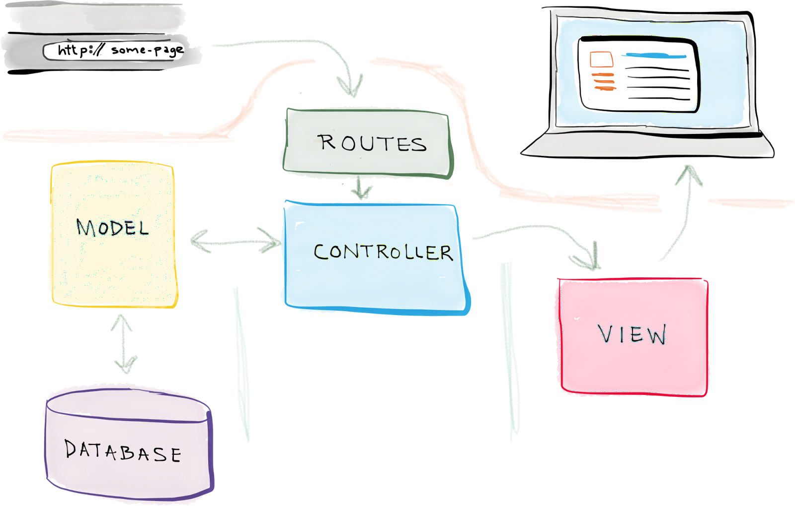
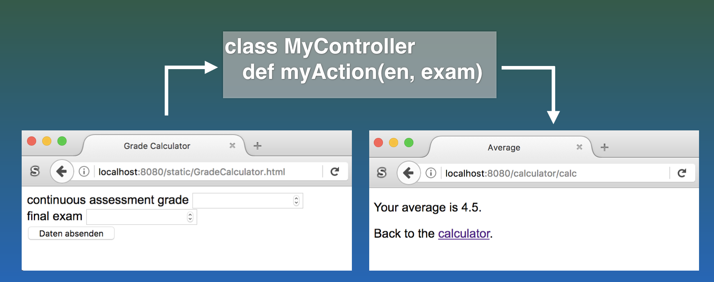
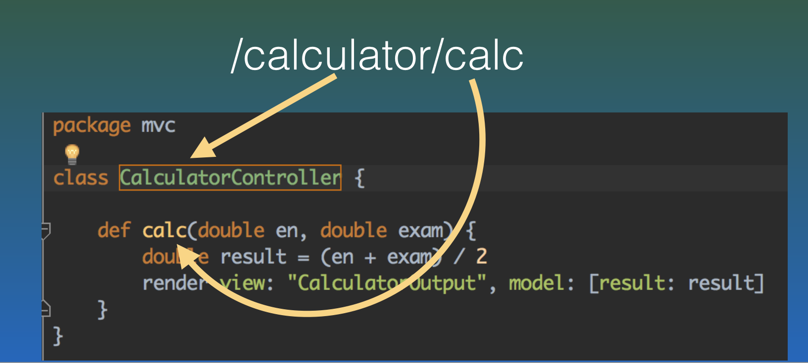
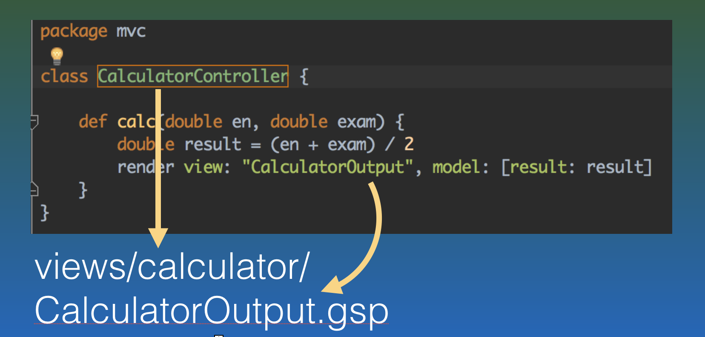
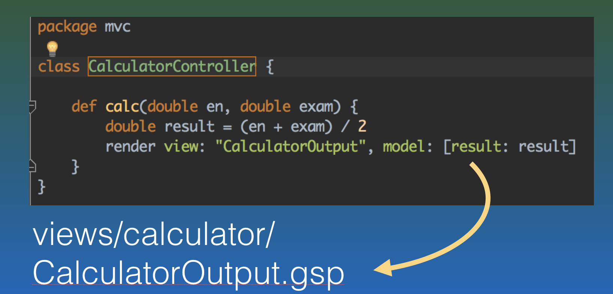
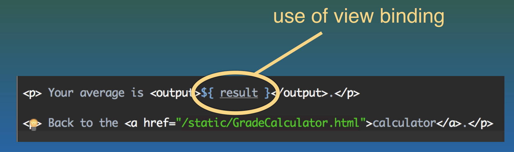

name: inverse
layout: true
class: center, middle, inverse
---
# Web Engineering
## MVC

.footnote[<a href="mailto:dierk.koenig@fhnw.ch">Prof. Dierk König</a><br /><a href="mailto:christian.ribeaud@fhnw.ch">Christian Ribeaud</a>]
---
layout: false
.left-column[
  ## MVC
]
.right-column[
**Model-View-Controller**



Discussion
- Avantages vs. Disadvantages?
]
???
- **Avantages**:
  - MVC supports rapid and parallel development.
- **Disadvantages**:
  - Increased complexity.
---
.left-column[
  ## MVC
  ### Model
]
.right-column[
Roles:
- Handles data and business logic.
- Interacts with the database (using **SQL**) or perform complex operations.
]
---
.left-column[
  ## MVC
  ### Model
  ### View
]
.right-column[
Roles:
- Presents data to the user in any supported format and layout.
- Could be _static_ **HTML** pages or _dynamic_ server pages.
]
---
.left-column[
  ## MVC
  ### Model
  ### View
  ### Controller
]
.right-column[
Roles:
- Receives user requests and calls appropriate resources to carry them out.
- Validates the input.
- Calls the appropriate _model_ for the task and then selects the proper _view_.
]
---
.left-column[
  ## Grails
]
.right-column[
- https://grails.org/
- **Groovy**-based web application framework for the **JVM** built on top of **Spring Boot**
- _Convention-over-configuration_ with sensible defaults
]
---
.left-column[
  ## Groovy
]
.right-column[
- http://groovy-lang.org/
- JVM-based language, dynamic, optional types and meta-programming
- https://www.manning.com/books/groovy-in-action-second-edition
- Example:
```java
def transform(List elements, Closure action) {
      def result = []
      elements.each {
        result << action(it)
      }
      result
}
String describe(Person p) {
      "$p.name is $p.age"
}
def action = this.&describe
def list = [
      new Person(name: 'Bob',   age: 42),
      new Person(name: 'Julia', age: 35)]
assert transform(list, action)
    == ['Bob is 42', 'Julia is 35']
```
]
---
.left-column[
  ## Spring Boot
]
.right-column[
- https://spring.io/projects/spring-boot
- **Spring Boot** is a project built on the top of the **Spring** framework. It provides a simpler and faster way to set up, configure, and run both simple and web-based applications.
- Auto-configuration, standalone, opinionated
- A lot of magic ...
]
---
.left-column[
  ## Gradle
]
.right-column[
- https://gradle.org/
- Build tool like **Maven** and similar
]
---
.left-column[
  ## Exercises
  ### Assignment 1
]
.right-column[
1. Make sure that you have a Java **JDK 1.8** installed and `JAVA_HOME` set appropriately. Check by running `java -version`
1. Fork and clone the boilerplate project located at https://github.com/ribeaud/WebEngineering-HS19.
1. Import the project into **IntelliJ IDEA** as described on project's [README.md](https://github.com/ribeaud/WebEngineering-HS19) page.
1. Run the automatically loaded run configuration and browse to http://localhost:8080/.
]
???
1. Explain forking, cloning and so on ...
1. Explain **Grails** project structure (code level).
1. Explain what we see at http://localhost:8080/.
1. _CalculatorController_ has been generated via `grails create-controller Calculator`
1. Create corresponding view and run the application
---
.left-column[
  ## Testing
]
.right-column[
- Is a core tenet of engineering.
- Provides validatable specification
s opposed to _just give it a try_.
]
---
.left-column[
  ## Testing
  ### Unit testing
]
.right-column[
- A unit is the smallest testable part of any software.
- Unit tests to validate controllers, models, and services in isolation.
- [Spock](http://spockframework.org/): structures test cases in
 _given_ - _when_ - _then_ - _expect_ and allow data-driven tests.
]
---
.left-column[
  ## Testing
  ### Unit testing
  ### Integration testing
]
.right-column[
- Individual units are combined and tested as a group. The purpose of this level of testing is to expose faults in the interaction between integrated units.
- Functional integration tests to validate the behaviour as seen by the user.
- [Geb](http://www.gebish.org/): user interactions with the **HTML** page
]
---
.left-column[
  ## Testing
  ### Unit testing
  ### Integration testing
  ### Geb selectors
]
.right-column[
| Geb                | HTML                 |
| : ---------------- | : ------------------ |
| `$("div.cool")`    | `<div class="cool">` |
| `$("a", href:"x")` | `<a href="x">`       |
| `$("a", text:"x")` | `<a>x</a>`           |
| `$("form").en`     | `<input name="en">`  |
]
---
.left-column[
  ## Recap
  ### Web View-Controller
]
.right-column[
### Web View-Controller


]
---
.left-column[
  ## Recap
  ### Web View-Controller
  ### Dispatch
]
.right-column[
### Dispatch


]
---
.left-column[
  ## Recap
  ### Web View-Controller
  ### Dispatch
  ### View Selection
]
.right-column[
### View Selection


]
---
.left-column[
  ## Recap
  ### Web View-Controller
  ### Dispatch
  ### View Selection
  ### View Binding
]
.right-column[
### View Binding


]
---
.left-column[
  ## Recap
  ### Web View-Controller
  ### Dispatch
  ### View Selection
  ### View Binding
  ### GSP View
]
.right-column[
### GSP View


]
---
.left-column[
## Exercises
### Assignment 1
### Assignment 2
]
.right-column[
Checkout branch _feature/calculator_ (`git checkout feature/calculator`) and have a look at:
- `http://localhost:8080/static/GradeCalculator.html`
- `src/main/resources/public/GradeCalculator.html`
- `src/test/groovy/mvc/CalculatorControllerSpec.groovy`
- `src/integration-test/groovy/mvc/CalculatorSpec.groovy` (note line 26 with _placeholder goes here_)
- `grails-app/controllers/mvc/CalculatorController.groovy`
- `grails-app/views/calculator/CalculatorOutput.gsp` (note the _output_ placeholder)
Use `${result}` in **CalculatorOutput.gsp** to put that calculated result in the right place. Verify that the test is still green.
]
---
.left-column[
  ## Exercises
  ### Assignment 1
  ### Assignment 2
  ### Assignment 3
]
.right-column[
1. Write a test, that goes to http://www.fhnw.ch and clicks on any link of the navigation bar.
1. Validate the page title.
]
---
.left-column[
  ## Exercises
  ### Assignment 1
  ### Assignment 2
  ### Assignment 3
  ### Assignment 4
]
.right-column[
- In the `GradeCalculator`: what happens when _en_ or _exam_ do not represent numbers?
- Extend the integration test to cover the invalid input scenario.
]
---
.left-column[
  ## Exercises
  ### Assignment 1
  ### Assignment 2
  ### Assignment 3
  ### Assignment 4
  ### Assignment 5
]
.right-column[
- What happens when _en_ or _exam_ do not fall into `1.0` - `6.0`?
- Write down how you would address this issue. **Unit** or **integration** test? Which code needs change: _test_, _controller_, _view_?
]
---
.left-column[
  ## Abilities
]
.right-column[
- Writing tests for page navigation.
- Writing tests for form submission.
- Implementing basic workflow: _form_ - _controller_ - _view_.
- Constructing **HTML** views with derived content.
]
---
.left-column[
  ## Knowledge
]
.right-column[
- Understanding the purpose and benefit of _functional_ tests on the web.
- Understanding the purpose and benefit of _unit_ tests.
- Understanding the web **MVC** cycle, _request-response_ paradigm.
- Using models for request data binding and response view creation.
]
