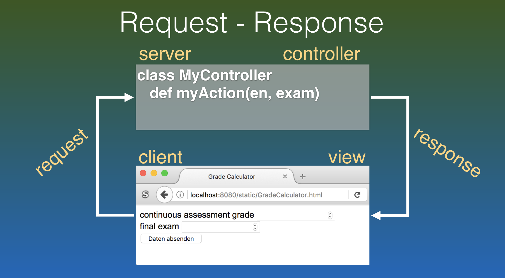

name: inverse
layout: true
class: center, middle, inverse
---
# Web Engineering
## Server Pages

.footnote[<a href="mailto:dierk.koenig@fhnw.ch">Prof. Dierk König</a><br /><a href="mailto:christian.ribeaud@fhnw.ch">Christian Ribeaud</a>]
---
layout: false
.left-column[
  ## Technology Overview
]
.right-column[
- [Grails](https://grails.org/)
- [Groovy](http://groovy-lang.org/)
- [Geb](http://www.gebish.org/) and [Spock](http://spockframework.org/)
- [Gradle](https://gradle.org/)
- [Spring Boot](https://spring.io/projects/spring-boot)
]
---
.left-column[
  ## The story so far
]
.right-column[
* Static Pages: **HTML**, **CSS**
* **MVC**: _Model_, _View_, _Controller_
* **View**: Could be a _static_ or a _server_ page
]
---
.left-column[
  ## Engineering aspects
]
.right-column[
* Valid **HTML**, **CSS**
* Avoid duplication (in **CSS**)
* Testing pages and navigation
* Validating models (imperative vs. declarative)
* **MVC**: [separation of concerns](https://en.wikipedia.org/wiki/Separation_of_concerns)
]
---
template: inverse
# Request - Response
---

???
https://www.youtube.com/watch?v=8ekMg88kGSs
---
template: inverse
# Page structure: 4 ways!
---
.left-column[
  ## GSP
]
.right-column[
- Server pages with values
- [Documentation](https://gsp.grails.org/)
- Example:
```gsp
<!DOCTYPE html>
<html>
<head>
    <meta name="layout" content="main"/>
    <title>Render Domain</title>
</head>
<body>
Last Name: ${person.lastName}<br/>
First Name: ${person.firstName}<br/>
Age: ${person.age} <br/>
</body>
</html>
```
]
---
.left-column[
  ## GSP
  ## Template
]
.right-column[
- **Local** composition
- Useful for partitioning your views into maintainable chunks:
  - Avoids _in-page_ code duplication
  - Parts of a page - as a page
- [Documentation](https://gsp.grails.org/latest/guide/viewsAndTemplates.html)
- Branch _feature/templating_
- Convention: _underscore_ before the name of a view
- Example:
  - `_bookTemplate.gsp`:
```gsp
<div class="book" id="${book?.id}">
   <div>Title: ${book?.title}</div>
   <div>Author: ${book?.author?.name}</div>
</div>
```
  - Usage:
```gsp
<tmpl:bookTemplate book="${myBook}" />
```
]
---
.left-column[
  ## GSP
  ## Template
  ## TagLib
]
.right-column[
- **Global** composition.
- Parts of content - as a method
- [Documentation](https://gsp.grails.org/latest/guide/taglibs.html)
- Branch _feature/taglib_
- **Groovy** class that ends with the convention `TagLib`
- Example:
  - `grails-app/taglib/SimpleTagLib.groovy`:
```gsp
class SimpleTagLib {
          def emoticon = { attrs, body ->
            out << body() << (attrs.happy == 'true' ?
              " :-)" : " :-(")
          }
}
```
  - Usage:
```gsp
<g:emoticon happy="true">Hi John</g:emoticon>
```
]
---
.left-column[
  ## GSP
  ## Template
  ## TagLib
  ## Layout
]
.right-column[
- **Inverse** composition ([Sitemesh](http://sitemesh.org/))
- Imposed embedding - as a page
- [Documentation](https://gsp.grails.org/latest/guide/layouts.html)
- Branch _feature/layout_
- Example:
  - `grails-apps/views/layouts/main.gsp`:
```gsp
<html>
    <head>
        <title><g:layoutTitle default="An example decorator" /></title>
        <g:layoutHead />
    </head>
    <body onload="${pageProperty(name:'body.onload')}">
        <div class="menu"><!-- my common menu goes here --></div>
        <div class="body"><g:layoutBody /></div>
    </body>
</html>
```
  - Usage:
```html
<html>
    <head>
        <title>An Example Page</title>
        <meta name="layout" content="main" />
    </head>
    <body>This is my content!</body>
</html>
```
]
???
- `layoutTitle`: outputs the target page’s title
- `layoutHead`: outputs the target page’s head tag contents
- `layoutBody`: outputs the target page’s body tag contents
---
.left-column[
  ## Abilities
]
.right-column[
- Being able to use dynamic content in **Server Pages**
- Using _pages_, _templates_, _taglibs_, and _layouts_
- Testing appropriately
]
---
.left-column[
  ## Knowledge
]
.right-column[
- Understanding the _request-response_ cycle
- Understanding the four ways of composing **Server Pages** plus when to use which
- Where and how to validate
- Optional: using **Grails** internationalized error messages for generic error display
]
