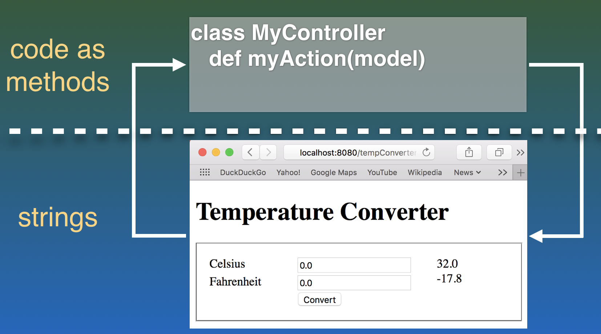
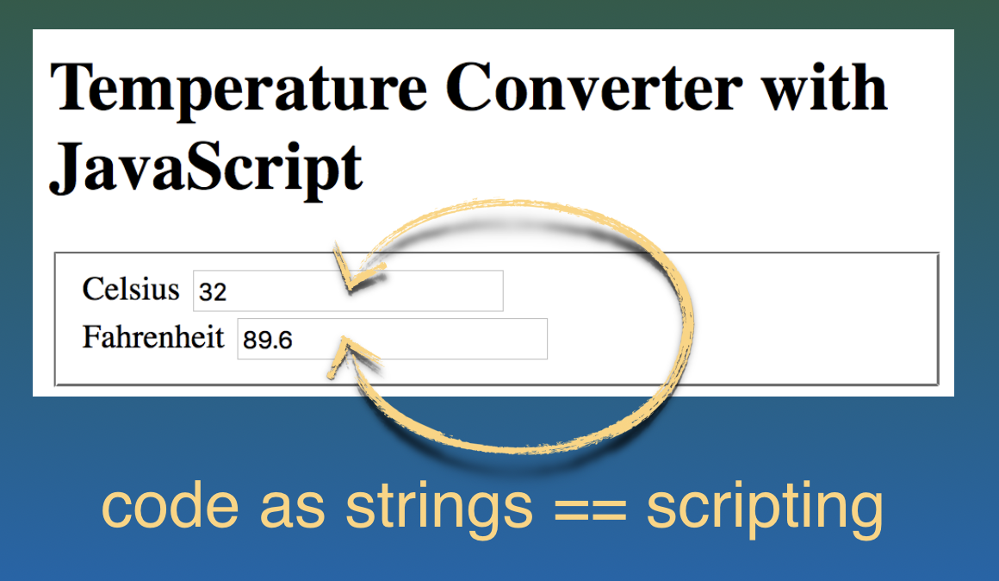
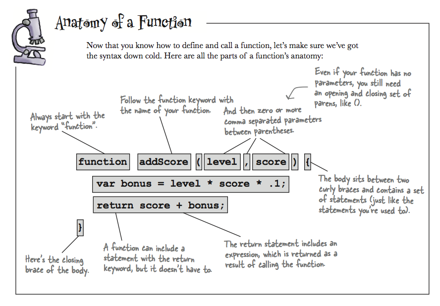

name: inverse
layout: true
class: center, middle, inverse
---
# Web Engineering
## JavaScript

.footnote[<a href="mailto:dierk.koenig@fhnw.ch">Prof. Dierk König</a><br /><a href="mailto:christian.ribeaud@fhnw.ch">Christian Ribeaud</a>]
---
layout: false
.left-column[
  ## Story So Far
]
.right-column[
- Static pages: **HTML** and **CSS**
- **MVC**: `Model`, `View`, `Controller`
- View: static page, server page, **dynamic page** (new!)
]
---
.left-column[
  ## Request-Response
]
.right-column[
  
]
---
.left-column[
  ## Direct Manipulation
]
.right-column[
  

  **JavaScript** is THE [Scripting language](https://en.wikipedia.org/wiki/Scripting_language) for web browsers.
  **Java** vs. **JavaScript**: what are the differences between both languages?
]
???
- Compiled vs. Interpreted
- Both can run in a browser but ...
- Both can run on a server
- **Java** is a _strongly_, _statically_ typed, **JavaScript** is _dynamically_ typed
- [Why is JavaScript called JavaScript?](https://stackoverflow.com/questions/2018731/why-is-javascript-called-javascript-since-it-has-nothing-to-do-with-java)
- [javascript.html](javascript.html)
---
.left-column[
  ## JavaScript
]
.right-column[
Version:
- **ES2018 (ES9)** (https://www.w3schools.com/js/js_versions.asp)

Where To:
- Code as string (`eval` method)
- **HTML** attribute value (i.e., `onclick` attribute)
- Text content  of `<script>` element
- External **.js** file

To quickly try out some **JavaScript**:
- Developer tools of your browser
- Write a small **HTML** file
- https://jsfiddle.net/
]
---
.left-column[
  ## Event Attributes
]
.right-column[
**onclick**, **onmouseover**, **onchange** (_input_ field), ...
```html
<!DOCTYPE html>
<html>
<body>
<h1 onclick="this.innerHTML = 'Ooops!'">
  Click on this text!</h1>
</body>
</html>
```
]
???
- https://codeburst.io/javascript-wtf-is-es6-es8-es-2017-ecmascript-dca859e4821c
---
.left-column[
  ## Document
]
.right-column[
When an **HTML** document is loaded into a web browser, it becomes a **document object**.

We have following useful methods:
- `document.write(html)`: Writes **HTML** expressions to a document.
- `document.getElementById(id)`: Gets the element with the specified ID.
- `document.querySelector(selector)`: Gets the first element found with given _selector_.
- `document.querySelectorAll(selector)`: Gets all the elements found with given _selector_.

#### Examples

```html
document.querySelector("p.example");
document.querySelector("div > p");
```
]
---
.left-column[
  ## Element
]
.right-column[
In the **HTML** DOM, the **element object** represents an **HTML** element, like `p`, `div`, `a`, `table`, or any other **HTML** element.

We have following useful attributes/methods:

- `element.id // Gets the ID of an element`
- `element.value = newValue; // Set element's value to given new one`
- `element.innerHTML = newContent; // Sets or returns the content of an element`
- `element.classList.add(newStyle); // Adds new style class to list of already present ones`
]
---
.left-column[
  ## Function Declaration
]
.right-column[

]
---
.left-column[
  ## Engineering Aspects
]
.right-column[
#### Where to put **JavaScript** code:
- _in-line_ only for one-liners
- _in-page_ for **local** functions
- _.js_ files for **cross-page** sharing,
 unit testing, [linting](https://en.wikipedia.org/wiki/Lint_%28software%29), tool support, ...
]
???
- Where should I put `<script>` tags in **HTML** markup?
  + https://stackoverflow.com/questions/436411/where-should-i-put-script-tags-in-html-markup
  + https://stackoverflow.com/questions/30653081/why-scripts-at-the-end-of-body-tag
  + https://blog.logrocket.com/how-browser-rendering-works-behind-the-scenes-6782b0e8fb10
---
template: inverse

## Demo/Live-coding
---
.left-column[
  ## Exercises
]
.right-column[
- https://www.w3schools.com/js/js_exercises.asp
- https://www.w3schools.com/js/js_quiz.asp
]
---
.left-column[
  ## Exercises
  ### Assignment 1
]
.right-column[
1. Erstellen Sie in Ihrem Projekt einen neuen Branch namens _javascript_.
1. Implementieren Sie die Mittelwertberechnung in **JavaScript**.
]
---
.left-column[
  ## Exercises
  ### Assignment 1
  ### Assignment 2
]
.right-column[
1. Project [RoomReservation](https://github.com/ribeaud/RoomReservation), branch _services_solution_
1. Start the application and go to the static page _pictures.html_ (http://localhost:8080/static/pictures.html)
1. Work through the **JavaScript** solution to fetch **Flickr** photos
]
---
.left-column[
  ## Exercises
  ### Assignment 1
  ### Assignment 2
  ### Assignment 3
]
.right-column[

### Temperatur Converter

1. Write a simple temperature converter using **HTML**, **CSS** and **JavaScript** only (one page, no **Grails**).
1. This converter converts **Celsius** into **Fahrenheit**.

### Possible extensions

1. Make a **Grails** application out of it: conversion and validation happens now on server side.
]
???
- [TemperatureConverter.html](TemperatureConverter.html)
---
.left-column[
  ## Abilities
]
.right-column[
- Being able to use **JavaScript** for form validation
- Using **JavaScript** for client-side application logic
- Modularize **JavaScript** code in functions
- Integration testing of pages that use javascript
]
---
.left-column[
  ## Knowledge
]
.right-column[
- Understanding how to use event handling attributes and **JavaScript** code
- Distinguishing between _in-line_, _in-page_, and _.js-file_ code
- Understanding the idea of _scripting_
- Understanding the general differences between **Java** and **JavaScript**
]
---
.left-column[
  ## Resources
]
.right-column[
Basic **JavaScript** objects for use in the browser:
- https://www.w3schools.com/js/
- https://www.codecademy.com/learn/learn-javascript

Favorite **JS** learning resources from [Joel from egghead](https://egghead.io/instructors/joel-hooks):
- https://learnvanillajs.com/roadmap/
- https://learnjavascript.online/
- https://learn.co/courses/introduction-to-javascript
- https://watchandcode.com/p/practical-javascript
- https://javascript.info/
- https://eloquentjavascript.net/
]