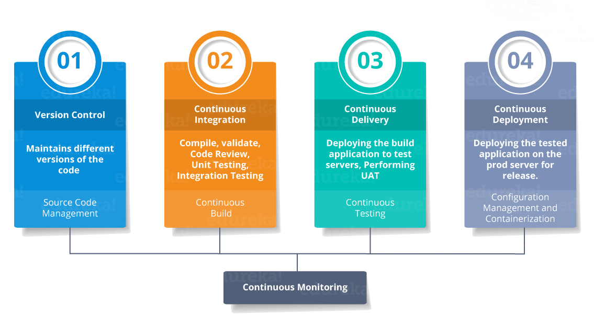
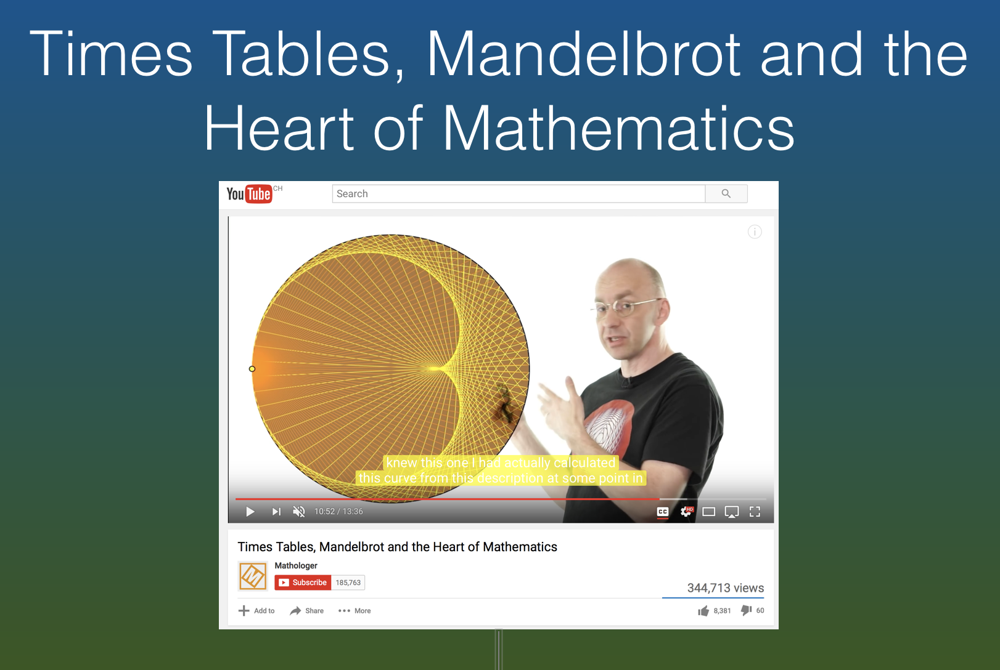
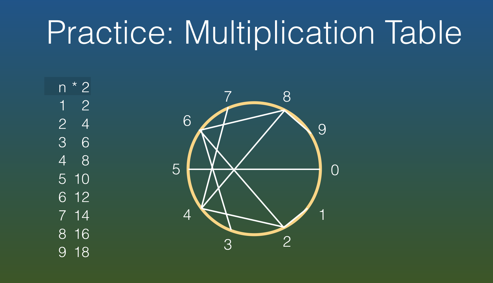

name: inverse
layout: true
class: center, middle, inverse
---
# Web Engineering
## Testing, Consolidation

.footnote[<a href="mailto:dierk.koenig@fhnw.ch">Prof. Dierk König</a><br /><a href="mailto:christian.ribeaud@fhnw.ch">Christian Ribeaud</a>]
---
layout: false
.left-column[
  ## Testing
  ### Unit
]
.right-column[
- Tests a small piece of code
- Simulates the rest of pieces (via **Mock** for instance)
- Very quick
- Independent of the environment
- Example: `CalculatorControllerSpec`: implements [ControllerUnitTest](https://testing.grails.org/latest/api/grails/testing/web/controllers/ControllerUnitTest.html) (**Grails** integration), extends [Specification](http://spockframework.org/spock/docs/1.3/all_in_one.html#_specification) (**Spock** integration).
]
???
- https://testing.grails.org/latest/guide/index.html
---
.left-column[
  ## Testing
  ### Unit
  ### Spock
]
.right-column[
In **Spock**, you write _specifications_. Every test class must extend from `spock.lang.Specification`. It is a testing and a specification framework.

[Blocks](http://spockframework.org/spock/docs/1.0/spock_primer.html) (inspired by [BDD](https://en.wikipedia.org/wiki/Behavior-driven_development)):


Sometimes `given:` is used instead of `setup:`. It is an alias.
]
???
- https://www.pluralsight.com/guides/introduction-to-testing-with-bdd-and-the-spock-framework
---
.left-column[
  ## Testing
  ### Unit
  ### Spock
]
.right-column[
- Describe test:
```groovy
import spock.lang.Specification
class HelloWorldTest extends Specification {

      def "scenario 1"() {
        given: "An integer with value 5"
        def i = 5

        when: "This integer is multiplied by 2"
        i = i * 2

        then: "The final value is 10"
        assert i != 5
        i == 10
      }
}
```
- [Data Driven Testing](http://spockframework.org/spock/docs/1.3/all_in_one.html#_data_driven_testing)
- _Fixture_ methods are responsible for setting up and cleaning up the environment in which feature methods are run.
```groovy
def setup() {}       // run before every feature method
def cleanup() {}     // run after every feature method
def setupSpec() {}   // run before the first feature method
def cleanupSpec() {} // run after the last feature method
```
]
???
- @Unroll
- http://jakubdziworski.github.io/java/groovy/spock/2016/05/14/spock-cheatsheet.html
---
.left-column[
  ## Testing
  ### Unit
  ### Spock
  ### Integration
]
.right-column[
- Tests a complete functionality
- Starts the app
- Slow
- Depends on the environment
]
---
.left-column[
  ## Testing
  ### Unit
  ### Spock
  ### Integration
  ### Geb
]
.right-column[
- Browser automation solution, **WebDriver** based
- Integration with **Spock**, **TestNG** or **JUnit**
- **jQuery** syntax:
```groovy
// CSS 3 selectors
$("div.some-class p:first[title='something']")
// Find via index and/or attribute matching
$("h1", 2, class: "heading")
$("p", name: "description")
$("ul.things li", 2)
```
]
???
- https://entwicklertag.de/karlsruhe/2015/sites/entwicklertag.de.karlsruhe.2015/files/folien/20150520_final_spock_geb_sd.pdf
- [GebConfig.groovy](https://github.com/geb/geb-example-gradle/blob/master/src/test/resources/GebConfig.groovy)
- https://github.com/SeleniumHQ/selenium/wiki/ChromeDriver
- https://sites.google.com/a/chromium.org/chromedriver/downloads
- http://chromedriver.storage.googleapis.com/index.html
---
.left-column[
  ## Big Picture
]
.right-column[


]
???
https://dzone.com/articles/learn-how-to-setup-a-cicd-pipeline-from-scratch
---
.left-column[
  ## Consolidation
]
.right-column[
- **Abilities**: Make a full web solution
- **Knowledge**: Consolidate the knowledge about **HTML**, **CSS**, **Web MVC**, **Server Pages**
]
---
.left-column[
  ## Consolidation
  ### Resources
]
.right-column[
[Mathologer](https://www.youtube.com/channel/UC1_uAIS3r8Vu6JjXWvastJg): Times tables, [Mandelbrot](https://en.wikipedia.org/wiki/Mandelbrot_set) and the heart of **Mathematics**


- https://www.youtube.com/watch?v=qhbuKbxJsk8
- https://github.com/ribeaud/Mathologer
]
---
.left-column[
  ## Consolidation
  ### Resources
  ### Multiplication Table
]
.right-column[

]
---
.left-column[
  ## Consolidation
  ### Resources
  ### Multiplication Table
  ### Examples
]
.right-column[

]
---
.left-column[
  ## Demo/Code Walkthrough
]
.right-column[
- Visit the **TODOs** in the code:
  - `MultiplicationCircleController`
  - `multiplicationCircle/show.gsp`
  - `integration-test/MultiplicationCircleSpec`
  - `test/MultiplicationCircleControllerSpec`
]
---
.left-column[
  ## Practical Work
]
.right-column[
- Make the counting-down for the segment count work, incl. the test
- Add a _tableBase_ such that we can show the circle for many bases
]
---
.left-column[
  ## Homework
]
.right-column[
- Finish the practical work
- Work through the resources (see above)
]

