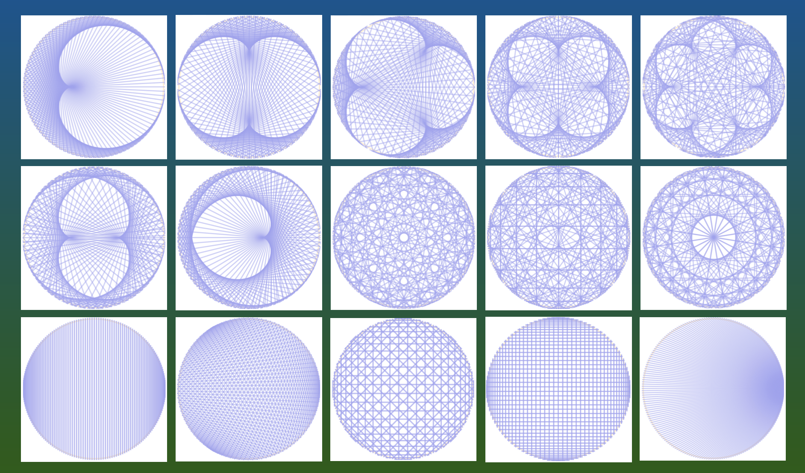

name: inverse
layout: true
class: center, middle, inverse
---
# Web Engineering
## Testing, Consolidation

.footnote[<a href="mailto:dierk.koenig@fhnw.ch">Prof. Dierk König</a> <a href="mailto:christian.ribeaud@fhnw.ch">Christian Ribeaud</a>]
---
layout: false
.left-column[
  ## Testing
  ### Unit
]
.right-column[
- Tests a small piece of code
- Simulates the rest of pieces (via **Mock** for instance)
- Very quick
- Independent of the environment
- Example: `CalculatorControllerSpec`: implements [ControllerUnitTest](https://testing.grails.org/latest/api/grails/testing/web/controllers/ControllerUnitTest.html) (**Grails** integration), extends [Specification](http://spockframework.org/spock/docs/1.3/all_in_one.html#_specification) (**Spock** integration).
]
???
- https://testing.grails.org/latest/guide/index.html
---
.left-column[
  ## Testing
  ### Unit
  ### Spock
]
.right-column[
- Describe test
- [Blocks](http://spockframework.org/spock/docs/1.0/spock_primer.html)
- [Data Driven Testing](http://spockframework.org/spock/docs/1.3/all_in_one.html#_data_driven_testing)
- Fixture methods (comparison with **Junit**)
]
---
.left-column[
  ## Testing
  ### Unit
  ### Spock
  ### Integration
]
.right-column[
- Tests a complete functionality
- Starts the app
- Slow
- Depends on the environment
]
---
.left-column[
  ## Testing
  ### Unit
  ### Spock
  ### Integration
  ### Geb
]
.right-column[
]
---
.left-column[
  ## Consolidation
]
.right-column[
- **Abilities**: Make a full web solution
- **Knowledge**: Consolidate the knowledge about **HTML**, **CSS**, **Web MVC**, **Server Pages**
]
---
.left-column[
  ## Consolidation
  ### Resources
]
.right-column[
[Mathologer](https://www.youtube.com/channel/UC1_uAIS3r8Vu6JjXWvastJg): Times tables, [Mandelbrot](https://en.wikipedia.org/wiki/Mandelbrot_set) and the heart of **Mathematics**

https://www.youtube.com/watch?v=qhbuKbxJsk8
]
---
.left-column[
  ## Consolidation
  ### Resources
  ### Multiplication Table
]
.right-column[

]
---
.left-column[
  ## Consolidation
  ### Resources
  ### Multiplication Table
  ### Examples
]
.right-column[

]
---
.left-column[
  ## Demo/Code Walkthrough
]
.right-column[
- Visit the **TODOs** in the code:
  - `MultiplicationCircleController`
  - `multiplicationCircle/show.gsp`
  - `integration-test/MultiplicationCircleSpec`
  - `test/MultiplicationCircleControllerSpec`
]
---
.left-column[
  ## Practical Work
]
.right-column[
- Make the counting-down for the segment count work, incl. the test
- Add a _tableBase_ such that we can show the circle for many bases
]
---
.left-column[
  ## Homework
]
.right-column[
- Finish the practical work
- Work through the resources (see above)
]

