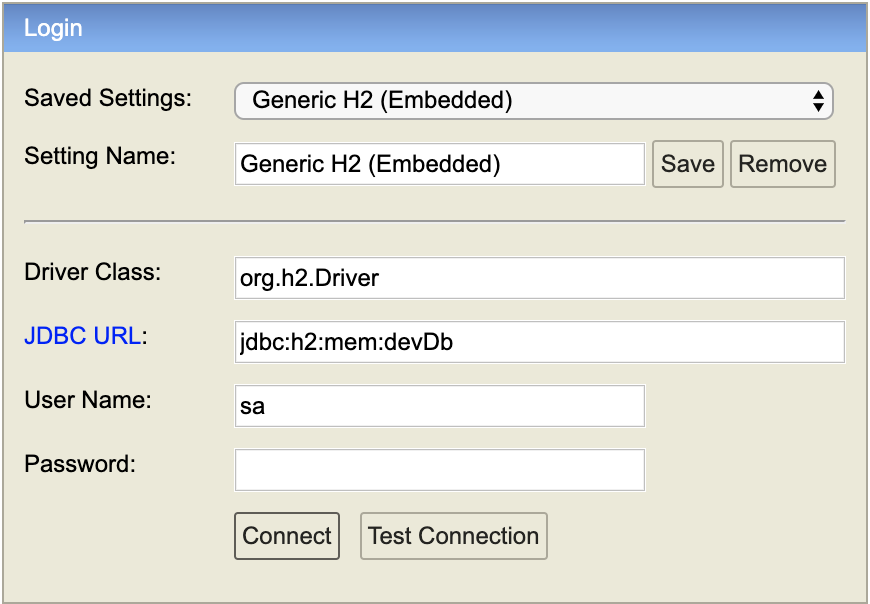

name: inverse
layout: true
class: center, middle, inverse
---
# Web Engineering
## Persistence

.footnote[<a href="mailto:dierk.koenig@fhnw.ch">Prof. Dierk König</a><br /><a href="mailto:christian.ribeaud@fhnw.ch">Christian Ribeaud</a>]
---
layout: false
.left-column[
  ## Web MVC, Server Pages
]
.right-column[

]
???
**MVC** is an architectural pattern commonly used for developing user interfaces that divides an application into three interconnected parts.
---
layout: false
.left-column[
  ## 3-tier WebApp
]
.right-column[

]
???
Multilayered architecture is a client–server architecture in which presentation, application processing, and data management functions are physically separated.
---
.left-column[
  ## Domain classes
]
.right-column[
```Groovy
package mvc

class Room {

    String name
    int    max

    String toString() {
        "$name ($max)"   // Groovy :-)
    }

    static constraints = {
        name(blank: false)
        max(min: 1)
    }
}
```
]
---
.left-column[
  ## CRUD methods
]
.right-column[
**GORM** Data Services will implement queries for you using a number of different strategies and conventions.

| Method Stem                                    | Description                                                |
| -----------------------------------------------|------------------------------------------------------------|
| count*                                         | Count the number of results                                |
| countBy*                                       | Dynamic Finder Count the number of results                 |
| delete*                                        | Delete an instance for the given arguments                 |
| find\*, get\*, list\* or retrieve\*            | Query for the given parameters                             |
| findBy\*, listBy\*, findAllBy\* or getBy\*     | Dynamic finder query for given parameters                  |
| save\*, store\*, or persist\*                  | Save a new instance                                        |
| update\*                                       | Updates an existing instance. First parameter should be id |

```Groovy
new Room(name: "5.3A17", max: 40).save()
Room.list()
Room.findAllByCapacityGreaterThan(20)
def firstRoom = Room.get(1)
firstRoom.delete()
```
]
---
.left-column[
  ## Grails ORM
]
.right-column[
- [Object Relational Mapping (GORM)](http://docs.grails.org/latest/guide/GORM.html)
- [GORM for Hibernate](http://gorm.grails.org/latest/hibernate/manual/)
- Domain classes serve as [DAO](https://en.wikipedia.org/wiki/Data_access_object)/[DTO](https://en.wikipedia.org/wiki/Data_transfer_object)/Model
- Database is set up automatically
- Dynamic finder methods simplify usage
- Keep it simple
]
---
.left-column[
  ## Scaffolding
]
.right-column[
```Groovy
package mvc

class PersonController {
    static scaffold = Person
}
```
Controller actions and views are created transparently behind the scenes. And we can selectively override

]
---
.left-column[
  ## Testing
]
.right-column[
- Refer to https://testing.grails.org/latest/guide/index.html
- `HibernateSpec`: Specification for **Hibernate** tests (`... extends HibernateSpec`)
- `DomainUnitTest`: _trait_ for domain model testing (`... extends Specification implements DomainUnitTest<...>`). Similar to `ControllerUnitTest`.
]
---
.left-column[
  ## Abilities
]
.right-column[
- From a greenfield, being able to use a relational database with _create-read-update-delete_ (**CRUD**)
  functionality in a webapp.
- Use of simple entities, _many-to-one_, and _many-to-many_ relations.
]
---
.left-column[
  ## Knowledge
]
.right-column[
- Understanding **Grails** domain classes as simple entities.
- Understanding **Grails** domain classes with references as relations.
- Understanding dynamic finder methods.
]
---
.left-column[
  ## Demo/Live-coding
]
.right-column[
1. Creating a room reservation system:
  - `grails create-app RoomReservation`
1. Domain classes: `Room`, `Person`, `Booking` (very simple)
  - `./grailsw create-domain-class Room`
  - `./grailsw create-domain-class Person`
  - ...
1. Static scaffolding
  - `./grailsw create-scaffold-controller Person`
  - ...
1. Viewing the current status of the _embedded_ database via **/h2-console**

  

1. Setting up bootstrap data
1. Use Controller actions to interact with the domain model
]
---
.left-column[
  ## Practical Work
]
.right-column[
- Create an action that displays all bookings of a given person
- Create an action that displays all available rooms for a requested time slot today
]
---
.left-column[
  ## Homework
]
.right-column[
Finish the practical work (https://github.com/ribeaud/RoomReservation)

Build on the practical work from above to create a full Web **MVC**-Cycle (_without_ scaffolding) that shows:
- All bookings from today until eternity for a given person
- All available rooms for a requested day and time slot
]
