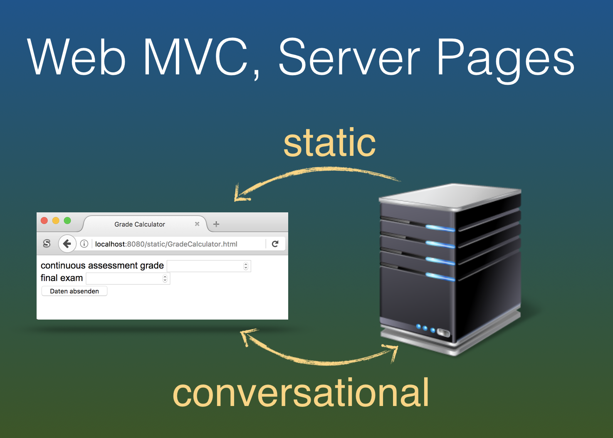
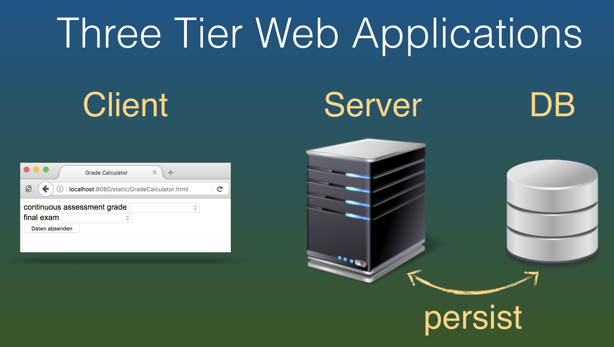

name: inverse
layout: true
class: center, middle, inverse
---
# Web Engineering
## Persistence

.footnote[<a href="mailto:dierk.koenig@fhnw.ch">Prof. Dierk König</a> <a href="mailto:christian.ribeaud@fhnw.ch">Christian Ribeaud</a>]
---
layout: false
.left-column[
  ## Web MVC, Server Pages
]
.right-column[

]
---
layout: false
.left-column[
  ## 3-tier WebApp
]
.right-column[

]
---
.left-column[
  ## Abilities
]
.right-column[
- From a greenfield, being able to use a relational database with _create-read-update-delete_ (**CRUD**)
  functionality in a webapp.
- Use of simple entities, _many-to-one_, and _many-to-many_ relations.
]
---
.left-column[
  ## Knowledge
]
.right-column[
- Understanding **Grails** domain classes as simple entities.
- Understanding **Grails** domain classes with references as relations.
- Understanding dynamic finder methods.
]
---
.left-column[
  ## Demo/Live-coding
]
.right-column[
- Creating a room reservation system
- Domain classes: `Room`, `Person`, `Booking` (very simple)
- Static scaffolding
- Setting up bootstrap data
- Use Controller actions to interact with the domain model
]
---
.left-column[
  ## Practical Work
]
.right-column[
- Create an action that displays all bookings of a given person
- Create an action that displays all available rooms for a requested time slot today
]
---
.left-column[
  ## Homework
]
.right-column[
Finish the practical work

Build on the practical work from above to
create a full Web MVC-Cycle (without scaffolding) that shows:
- All bookings from today until eternity for a given person
- All available rooms for a requested day and time slot
]
