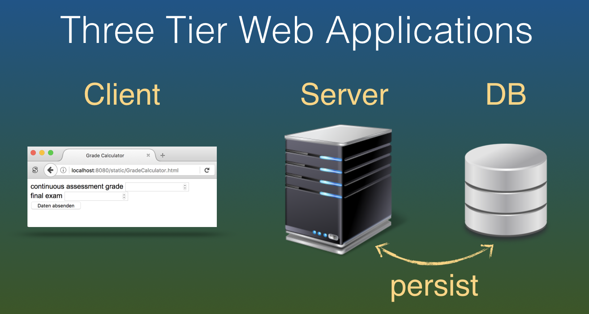
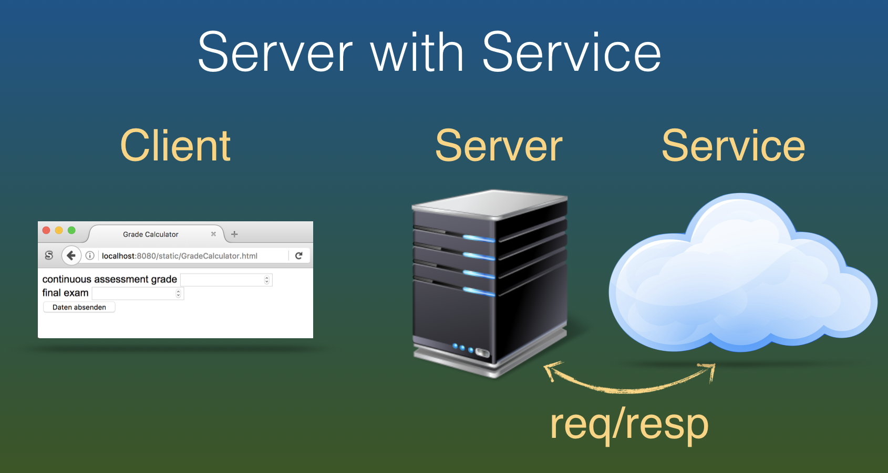
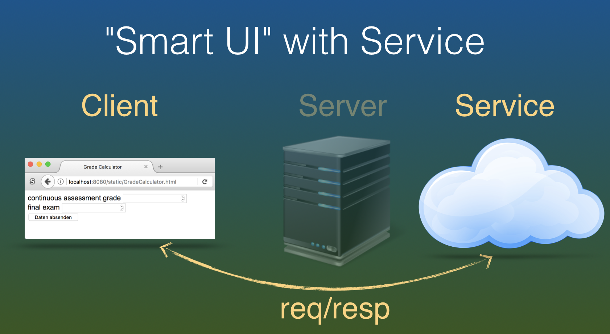
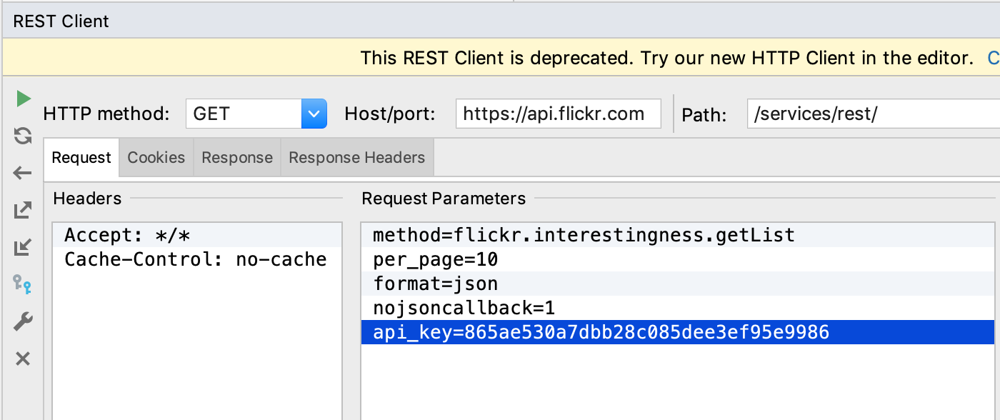
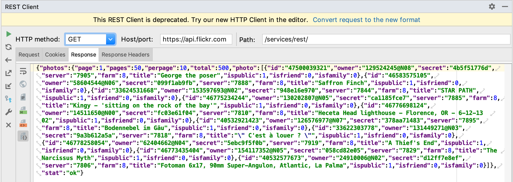
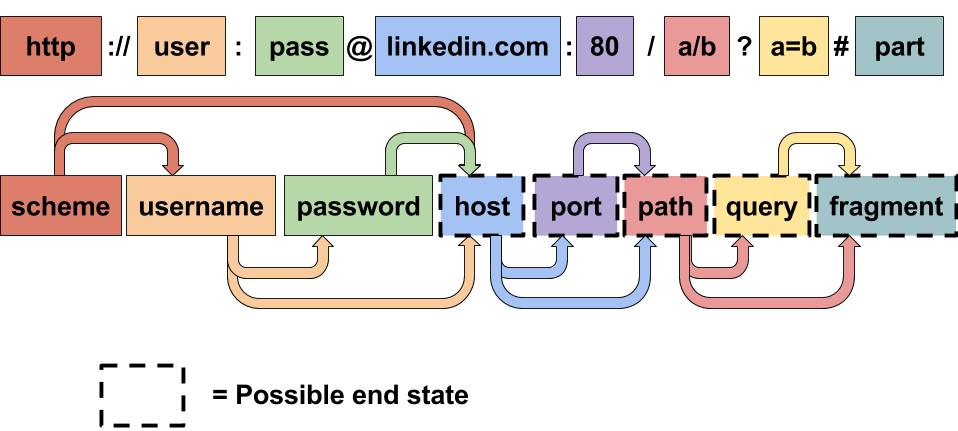
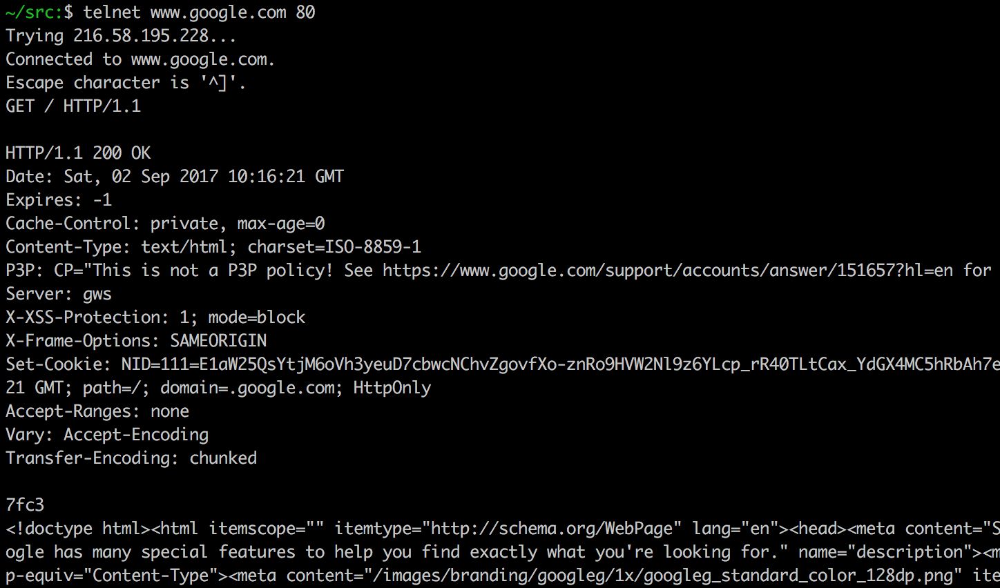

name: inverse
layout: true
class: center, middle, inverse
---
# Web Engineering
## Services

.footnote[<a href="mailto:dierk.koenig@fhnw.ch">Prof. Dierk König</a><br /><a href="mailto:christian.ribeaud@fhnw.ch">Christian Ribeaud</a>]
---
layout: false
.left-column[
  ## 3-tier architecture
]
.right-column[

]
---
.left-column[
  ## Server with service
]
.right-column[

]
---
.left-column[
  ## Smart UI with service
]
.right-column[

]
---
.left-column[
  ## REST API
]
.right-column[
- https://www.flickr.com/services/api/request.rest.html
- Get a key (for now use following one `865ae530a7dbb28c085dee3ef95e9986`)
]
---
.left-column[
  ## REST call
  ### REST client
]
.right-column[
REST client in **IntelliJ IDEA**:


]
???
- Have a look at `rest-api.http` as well
---
.left-column[
  ## REST API
  ### REST client
  ### Response
]
.right-column[


Fetch Resource URL Pattern:

`http://static.flickr.com/<server>/<id>_<secret>_b.jpg`
]
---
.left-column[
  ## HTTP(S)
  ### URL
]
.right-column[

]
---
.left-column[
  ## HTTP(S)
  ### URL
  ### Request
]
.right-column[
- **H**yper **T**ext **
T**ransfer **P**rotocol
- Very simple
- Line/delimiter based


]
---
.left-column[
  ## HTTP(S)
  ### URL
  ### Request
  ### Verbs
]
.right-column[
| Verb      | Safe | Use                                         |
|-----------|------|---------------------------------------------|
| GET       | Yes  | Single or collective read,<br>may be cached |
| PUT/PATCH | No   | Modify resource in place                    |
| POST      | No   | Create new resource                         |
| DELETE    | No   | Delete resource                             |
| HEAD      | Yes  | Retrieve metadata about the resource        |
| OPTIONS   | Yes  | Available HTTP verbs for a given resource   |

_Safe_ methods are **HTTP** methods that do not modify resources.

An _idempotent_ **HTTP** method is a **HTTP** method that can be called many times without different outcomes. It would not matter if the method is called only once, or ten times over. The result should be the same.
]
???
- https://spring.io/understanding/REST
- http://restcookbook.com/HTTP%20Methods/idempotency/
---
.left-column[
  ## HTTP(S)
  ### URL
  ### Request
  ### Verbs
  ### Status codes
]
.right-column[
- **2XX**: Success
- **3XX**: Redirection
- **4XX**: Client error
- **5XX**: Server error
]
???
- https://developer.mozilla.org/en-US/docs/Web/HTTP/Status
---
.left-column[
  ## REST
]
.right-column[
**Re**presentational **S**tate **T**ransfer

- Resource addressing by **URL**, resources easily understood directory structure **URIs**.
- Uniform operations by **HTTP** verbs
- Self-containment (no conversational state), stateless interactions store no client context on the server between requests.
- Choice of format (**XML**, **JSON**, ...)
]
---
.left-column[
  ## REST
  ### Issues
]
.right-column[
- Easy to get started - easy to get lost.
- Type safety, Versioning, Documentation (https://swagger.io)
- Addressing Operations (like _search_) as Resources
]
---
.left-column[
  ## REST
  ### Issues
  ### Alternatives
]
.right-column[
- [SOAP](https://www.w3schools.com/xml/xml_soap.asp) (WSDL - Determines operations, NOT resources)
- [CORBA](https://en.wikipedia.org/wiki/Common_Object_Request_Broker_Architecture) (IDL)
- [EJB](https://en.wikipedia.org/wiki/Enterprise_JavaBeans), \*-[RPC](https://en.wikipedia.org/wiki/Remote_procedure_call), [RMI](https://en.wikipedia.org/wiki/Java_remote_method_invocation)
- Local services (method invocation)
]
---
.left-column[
  ## REST
  ### Issues
  ### Alternatives
  ### Grails
]
.right-column[
- https://docs.grails.org/3.2.1/guide/webServices.html
- Note the usage of `@Resource` in domain classes and _respond_ instead of _render_ in the controller actions.
]
---
.left-column[
  ## Abilities
]
.right-column[
- Being able to use simple services from both client (smart view) and server (controller).
- Implementing the full range of **REST** services for a persistent **Grails** domain model.
]
---
.left-column[
  ## Knowledge
]
.right-column[
- Understanding **REST** principles on top of **HTTP** verbs.
]
---
.left-column[
  ## Resources
]
.right-column[
**REST**
- By **Roy Fielding**: http://www.ics.uci.edu/~fielding/pubs/dissertation/top.htm
- Best practices: https://restfulapi.net/resource-naming/

**REST** in **Grails**
- https://docs.grails.org/3.2.1/guide/webServices.html
- http://guides.grails.org/rest-hibernate/guide/index.html
- https://docs.grails.org/latest/guide/REST.html

**REST** docs usage
- https://github.com/jlstrater/grails-spring-restdocs-example
]
---
.left-column[
  ## Demo/Live-coding
]
.right-column[
- Show how to expose **Grails** domain classes and controller actions as **REST** endpoints with `@Resource` and `respond`.
- With **Curl**:
```
curl -i -X GET http://localhost:8080/people/1 \
      -H "Accept: application/xml"
curl -i -X POST -H "Content-Type: application/json" \
      -d '{"firstName":"Chris", "lastName": "Smith", \
      "email": "c@s.com"}' localhost:8080/people
curl -i -X PUT -H "Content-Type: application/json" \
      -d '{"email":"chris.smith@gmail.com"}' localhost:8080/people/3
```
]
???
- [Postman](https://www.getpostman.com/)
---
.left-column[
  ## Homework
]
.right-column[
- `SearchRestfulController.groovy`
]
---
.left-column[
  ## Practical work
]
.right-column[
- Write _integration_ tests against the **REST** API
]